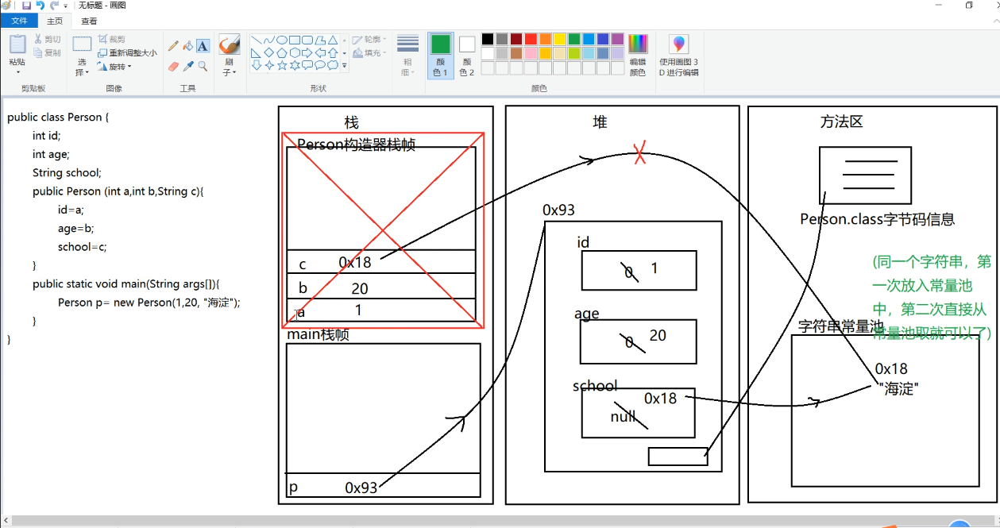
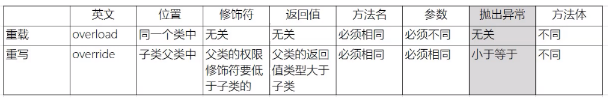

# 类与对象
- 第一次加载类的时候会进行类的加载，也就是跳转到 `ClassLoader.java`文件的 `loadClass` 方法，每个不同的类只需要加载一次。
- 成员变量有默认值，局部变量没有默认值，一定需要初始化。
- 引用类型（除了基础类型之外的所有类）做成员变量时不经初始化都会被赋值`null`。
- 在执行构造器方法之前类已经完成了类的内存空间分配、已经创建好了对象，所有成员变量已经完成了默认初始化，再执行构造器方法
- 初探内存分析：
    - 
- this:
    - 
- 在Java中，每当你调用一个方法时，Java虚拟机会创建一个称为"栈帧"（stack frame）的数据结构来存储该方法的局部变量、方法参数和其他与方法执行相关的信息。每个方法调用都会在调用栈中创建一个新的栈帧。
对于实例方法而言，每个栈帧还会包含一个指向当前对象的引用，这个引用就是this关键字所引用的对象。this引用存储在栈帧中的局部变量表中。
- JAVA运行时的内存分为三个部分：栈帧（主要存储局部变量以及形参）、堆（主要存储对象、数组）、方法区（字节码信息、字符串常量池、静态域）
  - 在类加载的时候也会将静态内容加载到方法区的静态域中（也即是静态区的内容先于对象创建、并且默认初始化）
  - 静态属性可以用于共享数据的情形
  - 静态方法只能访问类的静态属性（其他成员变量可能还未初始化）、不能访问非静态方法、不能访问this
  - 静态块在类加载时就执行，并且只执行一次
- import 导包时没有包含关系（导入package时 package 中 package的类不会被导入进去）
- 有关final实例域：可以将实例域定义为 final。 构建对象时必须初始化这样的域。也就是说， 必须确保在每一个构造器执行之后， 这个域的值被设置， 并且在后面的操作中， 不能够再对它进行修改。 例如， 可以将 Employee 类中的 name 域声明为 final, 因为在对象构建之后， 这个值不会再被修改， 即没有 setName 方法。
- 类方法的重写：子类重写父类方法时，方法名、参数列表要和父类完全一致
- 重载与重写的区别：重载发生在同一个类里面，方法名相同参数列表不同的情况；重写发生在父类子类之间，方法名以及参数列表相同的情况
- 类的构造器第一行都有一个省略的super(),先将父类的属性初始化完成。
- 在构造器中，super调用父类构造器和this调用子类构造器只能存在一个，两者不能共存因为super修饰构造器要放在第一行，this修饰构造器也要放在第一行:（本质上还是一个方法内不能两次使用super()）

# Object类
- toString 方法 
  - getClass().getName() + '@' + Integer.toHexString(hashCode())
- equals 方法
  - 比较引用类型时比较的是地址值
  - 可以先用instanceof判断要比较的类是否合法

# 多态
- 多态的要素:
  - 继承:Cat extends Animal ,ig extends Animal, Dog extends Animal
  - 重写:子类对父类的方法重写
  - 父类引用指向子类对象（向上转型）
- 多态的一种非常常见的应用场合:父类当方法的形参，然后传入的是具体的子类的对象然后调用同一个方法，根据传入的子类的不同展现出来的效果也不同，构成了多态。
- 向下转型：为了获取子类中特有的内容：
  - 在 中虽然使用`instanceo`判断了obj的类型，但编译器仍然把obj看做Object类型，想要使用其Phone类型的属性和方法就要向下转型。
- 当子类重写父类的类方法时，父类方法的字节码仍然存在于方法区中，但在方法调用时，会根据实际对象的类型来决定使用哪个方法实现。这个过程被称为动态方法调度（Dynamic Method Dispatch）。具体来说，方法区中存储了类的方法表（Method Table），该表记录了每个方法的字节码地址。当调用一个重写的类方法时，Java虚拟机会根据对象的实际类型在方法表中查找相应的方法字节码，然后执行该方法。